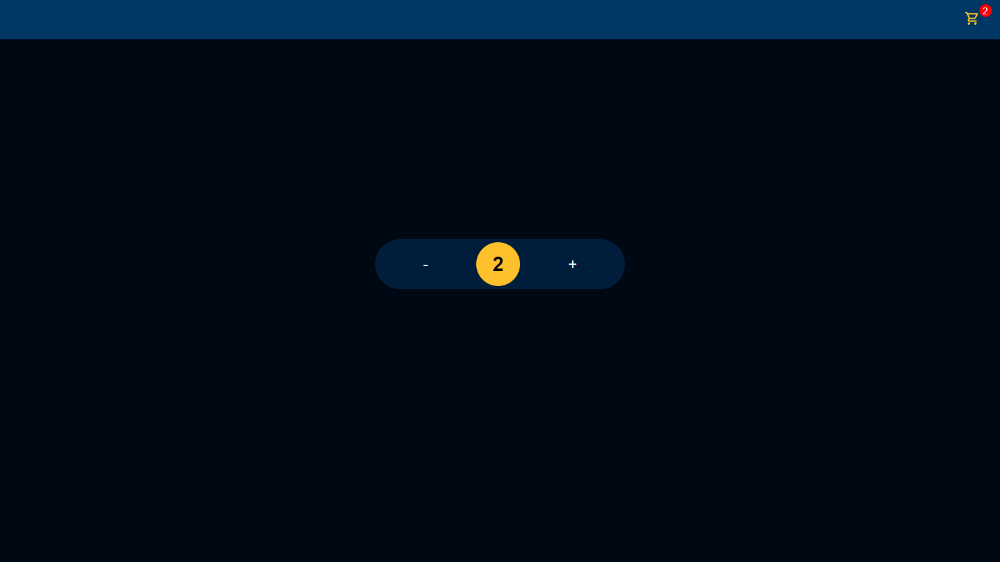

    

# Table of Contents
1. [Redux Content](#redux-content);
2. [How to implement redux in your application?](#how-to-implement)

## Redux Content

> __Documentation [here](https://redux.js.org/)__

This project use Redux to learn more about [Redux](https://redux.js.org/).💻

Redux is a technology to management of state.📚
In my case, I use to create a _Counter_ and list this result to _Cart_ state.

## How to implement?

- 🤗 In first case, create new folder and this folder you have create an `Store` to implement 'configureStore';
This configuration is to your Redux Store, [see here for more](https://redux.js.org/api/store);

- ✅ In next step, you have import in your `index.tsx/index.jsx` (main file) the _Provider_. It's a container to set the `store` that your create in first case.

- 🚀 In next step, you can create an `(anything)Slice.ts/(anything)Slice.js` in folder that you will use. This file, is where you will create of __Actions__ and __ActionsType__ for your state. And you must export as default this slice to use in _store_ file.😁

- After past step, you have set this _slice_ in __Reducer__ of `configureStore({})`, for example:

>`
export const store = configureStore({
    reducer: {
        counter: counterReducer,
    }
})
`
- Now you can use your Redux. Import redux actions to your component for you use and import `useDispatch` of `react-redux` to change of state in store. Pass your action to useDispatch params and be happy!🎉✔
